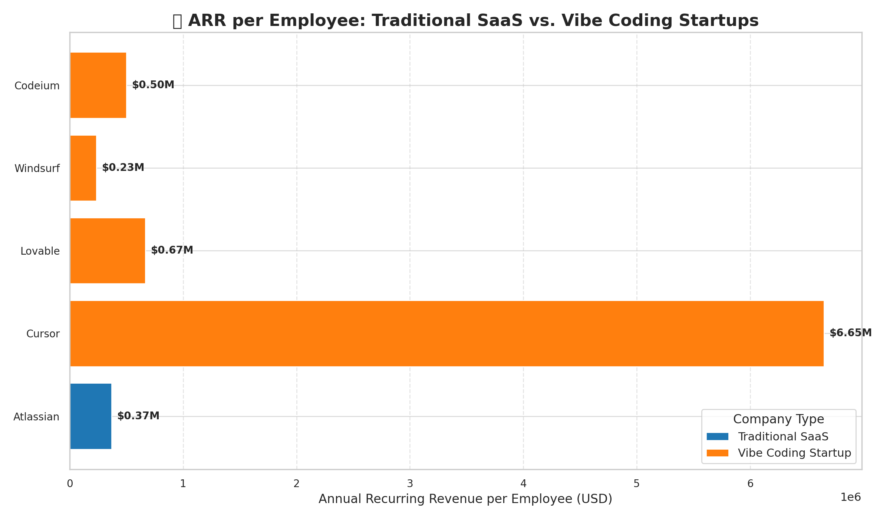
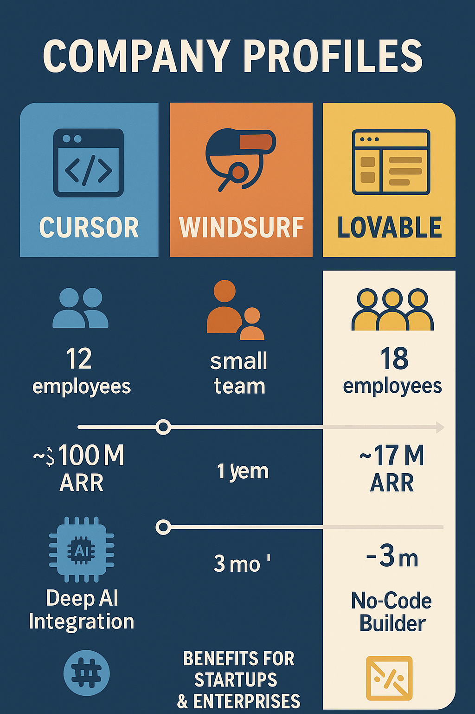
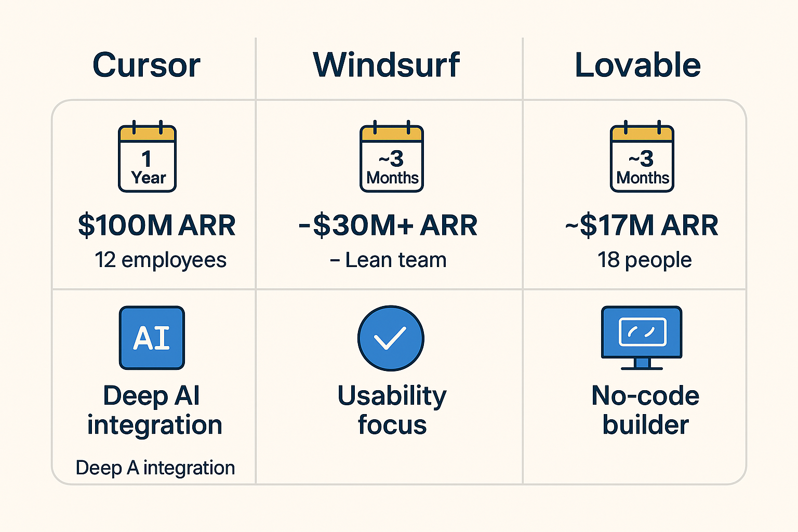
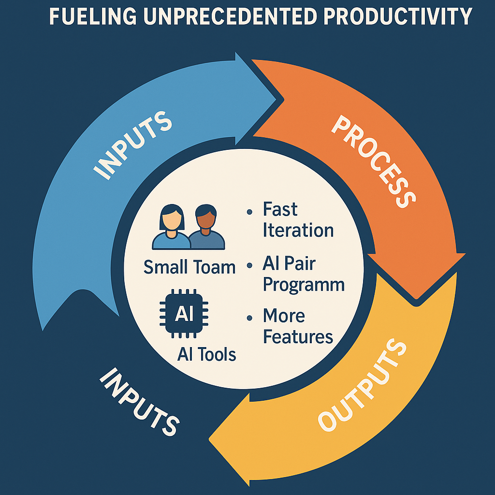

What if writing code felt less like debugging and more like a jam session? A new wave in software development called **vibe coding** is making that a reality. Startups are reaching massive milestones with tiny teams, signalling a cultural shift in how software gets built. Vibe coding – a term popularised by AI luminary Andrej Karpathy – captures an emerging style of programming where developers work hand-in-hand with AI, riding a creative "flow" to build software faster and more enjoyably. This isn’t just a new tool, but a new mindset – one that’s already enabling record-breaking productivity and changing what it means to be a software developer.

## What is Vibe Coding?

At its core, vibe coding is an approach to software development that emphasises flow, speed, and collaboration with AI over meticulous manual coding. Traditional coding often demands precision and careful planning; vibe coding instead lets developers set the vision or “vibe” of what they want, and rely on AI-powered assistants to generate and refine the code.

This matters because it transforms the developer’s experience. When coding feels intuitive and even playful, developers can attempt bolder ideas and iterate faster. It also opens the door for people who aren’t traditional software engineers to create software by describing their goals in natural language. In short, vibe coding shifts programming from a painstaking exercise into a more approachable, high-level creative process – without sacrificing results.

## Why Does Vibe Coding Matter?

The vibe coding movement isn’t just a feel-good story; it’s yielding astonishing productivity gains. For businesses, the impact is most obvious in one metric: annual recurring revenue (ARR) per employee. In traditional SaaS companies, an ARR per head of ~$200k is considered “good,” and ~$275k is “great”. Now, compare that to the new vibe coding upstarts:

*   **Lovable:** ~18 employees, ~$18M ARR → ~$1M per employee
*   **Cursor:** ~12 employees, ~$100M ARR → ~$8.3M per employee
*   **Windsurf:** ~small team, ~$30M+ ARR → likely ~$1M+ per employee
*   **Codeium:** small team, ~$40M ARR
*   **StackBlitz/Bolt:** ~$8M ARR in 2 months after Bolt launch
*   **Replit:** ~100 employees, ~$50M ARR → ~$500k per employee

 *[Chart comparing ARR/employee]*

## The Culture Shift Behind the Code

Crucially, vibe coding is as much about culture and workflow as it is about tools. Embracing vibe coding means embracing a development culture that values speed, experimentation, and developer autonomy. Vibe coding teams live by the mantra: “Make speed 🏎️ a core cultural value – fast doesn’t mean sloppy.”

*   Small, flat teams of high-agency generalists
*   Developer-led iteration and AI pair programming
*   High velocity, constant experimentation
*   Blurred roles – PMs, designers, and engineers co-creating with AI

 *[ Diagram comparing team structures]*

## Vibe Coding in Action: Case Studies

### Cursor
*   AI-powered editor forked from `VS Code`
*   ~$100M ARR in 1 year, ~12 employees
*   Tight feedback loop with AI: generate, test, refactor on the fly
*   Built using their own AI-powered tools

### Windsurf
*   Focus on clean UX, AI agent "Cascade"
*   Live editing and shell command execution
*   ~$30M+ ARR with lean team

### Lovable
*   No-code AI engineer platform
*   Reached ~$17M ARR in ~3 months with 18 people
*   Builds full-stack apps from natural language prompts
*   Democratises software creation beyond engineers

 *[Company profile infographic]*

## The Opportunity for Companies

*   **10x Productivity Gains:** Fewer people building more
*   **Lean, High-Impact Teams:** Cost-effective, faster iteration
*   **Faster Innovation:** AI shortens the distance between idea and execution
*   **Attracting Talent:** AI-native developers seek these environments
*   **Breaking Silos:** PMs, designers, engineers co-create
*   **New Revenue Streams:** AI internal tools → marketable products

 *[Flywheel model infographic]*

## Conclusion: Embrace the Vibe

Vibe coding is changing what it means to write software. It replaces drudgery with creativity, hand-offs with autonomy, and bureaucracy with velocity. The teams that embrace it aren’t just faster – they’re more fun, more empowered, and more likely to succeed in the age of AI.

> Let your developers vibe. The results might just speak for themselves.